# 🏗️ Arsitektur PNG to WebP Converter

## Gambaran Umum Arsitektur


## Struktur Direktori Lengkap

```
png_to_webp/
├── 📁 backend/                 # Rust Backend Service
│   ├── 📄 Cargo.toml          # Dependencies & metadata
│   ├── 📄 .env.example        # Environment template
│   ├── 📄 .gitignore          # Git ignore rules
│   └── 📁 src/
│       ├── 📄 main.rs          # Server setup & routing
│       ├── 📄 handlers.rs      # HTTP request handlers  
│       ├── 📄 services.rs      # Image processing logic
│       ├── 📄 models.rs        # Data structures
│       └── 📄 errors.rs        # Error handling
│
├── 📁 frontend/                # Next.js Frontend App
│   ├── 📄 package.json        # Dependencies & scripts
│   ├── 📄 next.config.js      # Next.js configuration
│   ├── 📄 tailwind.config.js  # Tailwind CSS config
│   ├── 📄 tsconfig.json       # TypeScript config
│   ├── 📄 .env.local.example  # Environment template
│   ├── 📄 .gitignore          # Git ignore rules
│   └── 📁 src/
│       ├── 📁 app/
│       │   ├── 📄 layout.tsx   # Root layout
│       │   ├── 📄 page.tsx     # Home page
│       │   └── 📄 globals.css  # Global styles
│       ├── 📁 components/
│       │   ├── 📄 Header.tsx           # App header
│       │   └── 📄 ImageConverter.tsx   # Main converter UI
│       └── 📁 lib/
│           ├── 📄 api.ts       # API client functions
│           └── 📄 types.ts     # TypeScript types
│
├── 📁 scripts/                 # Development automation
│   ├── 📄 setup-dev.sh        # Automated setup
│   ├── 📄 start-backend.sh    # Start backend only
│   ├── 📄 start-frontend.sh   # Start frontend only
│   └── 📄 start-dev.sh        # Start both services
│
└── 📄 README.md               # Project documentation
```

## Stack Teknologi Detail

### 🦀 Backend (Rust + Axum)

**Core Dependencies:**
```toml
[dependencies]
# Web Framework
axum = { version = "0.7", features = ["multipart"] }
tokio = { version = "1.0", features = ["full"] }
tower-http = { version = "0.5", features = ["cors", "fs", "trace"] }

# Image Processing
image = "0.25"        # Image loading & manipulation
webp = "0.3"          # WebP encoding/decoding

# Serialization & Utilities
serde = { version = "1.0", features = ["derive"] }
base64 = "0.22"       # Base64 encoding
uuid = { version = "1.6", features = ["v4"] }
chrono = { version = "0.4", features = ["serde"] }

# Error Handling & Logging
anyhow = "1.0"
thiserror = "1.0"
tracing = "0.1"
tracing-subscriber = { version = "0.3", features = ["env-filter"] }
```

**Arsitektur Backend:**
- **main.rs**: Entry point, server setup, CORS configuration
- **handlers.rs**: HTTP endpoint handlers (health check, convert image)
- **services.rs**: Business logic untuk image processing
- **models.rs**: Data structures untuk request/response
- **errors.rs**: Custom error types dan handling

### ⚛️ Frontend (Next.js + TypeScript)

**Core Dependencies:**
```json
{
  "dependencies": {
    "next": "14.2.5",           # React framework
    "react": "^18",             # UI library
    "react-dropzone": "^14.2.3", # File upload component
    "axios": "^1.6.0",          # HTTP client
    "lucide-react": "^0.427.0", # Icon library
    "tailwindcss": "^3.4.1"     # CSS framework
  }
}
```

**Arsitektur Frontend:**
- **App Router**: Next.js 14 app directory structure
- **TypeScript**: Type-safe development
- **Tailwind CSS**: Utility-first styling
- **Component Architecture**: Reusable React components
- **API Layer**: Centralized HTTP client

## 🌐 Komunikasi Antar Service

### API Endpoints

#### 1. Health Check
```http
GET /health
Content-Type: application/json
```

**Response:**
```json
{
  "status": "healthy",
  "service": "png-to-webp-converter", 
  "version": "0.1.0",
  "timestamp": "2025-08-30T10:00:00Z"
}
```

#### 2. Convert Image
```http
POST /api/convert
Content-Type: multipart/form-data

Field: image (file, PNG format, max 50MB)
```

**Response:**
```json
{
  "success": true,
  "message": "Image converted successfully",
  "filename": "output.webp",
  "webp_data": "base64_encoded_webp_data...",
  "original_size": 1048576,
  "converted_size": 524288,
  "compression_ratio": 50.0
}
```

### Request-Response Flow Detail

```mermaid
sequenceDiagram
    participant User as 👤 User
    participant UI as 🖥️ React UI
    participant API as 📡 API Client
    participant Server as 🦀 Axum Server
    participant Processor as 🖼️ Image Processor
    
    User->>UI: Drop/Select PNG file
    UI->>UI: Validate file (type, size)
    UI->>API: convertImage(file)
    API->>Server: POST /api/convert (multipart)
    
    Server->>Server: Parse multipart data
    Server->>Server: Validate PNG format
    Server->>Processor: convert_png_to_webp(data)
    
    Processor->>Processor: Load PNG with image crate
    Processor->>Processor: Convert to RGB format
    Processor->>Processor: Encode as WebP (quality 85)
    Processor->>Server: Return WebP bytes
    
    Server->>Server: Calculate compression stats
    Server->>Server: Encode WebP as base64
    Server->>API: JSON response + metadata
    
    API->>UI: ConvertResponse object
    UI->>UI: Create download URL
    UI->>User: Show results + download button
```



## 🔧 Dependency Utama & Fungsinya

### Backend Dependencies

| Crate | Fungsi | Alasan Pemilihan |
|-------|--------|------------------|
| `axum` | Web framework | Modern, type-safe, excellent async support |
| `tokio` | Async runtime | Industry standard untuk async Rust |
| `image` | Image processing | Mature, supports many formats |
| `webp` | WebP encoding | Dedicated WebP support |
| `tower-http` | Middleware | CORS, tracing, file serving |
| `serde` | Serialization | JSON serialization/deserialization |
| `base64` | Encoding | Encoding binary data untuk response |
| `tracing` | Logging | Structured logging dengan context |

### Frontend Dependencies

| Package | Fungsi | Alasan Pemilihan |
|---------|--------|------------------|
| `next` | React framework | SSR, routing, optimizations |
| `react-dropzone` | File upload | Drag & drop functionality |
| `axios` | HTTP client | Robust error handling, interceptors |
| `tailwindcss` | CSS framework | Rapid UI development |
| `lucide-react` | Icons | Modern, consistent icon set |
| `typescript` | Type safety | Compile-time error checking |

## 🚀 Alur Development

### 1. Setup Awal
```bash
./scripts/setup-dev.sh    # Automated setup
```

### 2. Development Mode
```bash
./scripts/start-dev.sh    # Start both services
```

### 3. Manual Development
```bash
# Terminal 1: Backend
cd backend && cargo run

# Terminal 2: Frontend  
cd frontend && npm run dev
```

### 4. Testing API
```bash
# Health check
curl http://localhost:8080/health

# Convert image (with test file)
curl -X POST -F "image=@test.png" http://localhost:8080/api/convert
```

## 🔒 Security & Performance

### Security Features
- **File type validation**: PNG magic bytes checking
- **File size limits**: 50MB maximum upload
- **CORS configuration**: Restricted to frontend domain
- **Input sanitization**: Safe error message handling
- **Memory safety**: Rust's compile-time guarantees

### Performance Optimizations
- **Async processing**: Non-blocking I/O operations
- **Efficient memory usage**: Streaming file uploads
- **Quality tuning**: WebP quality set to 85% for optimal balance
- **Frontend optimizations**: Code splitting, lazy loading
- **Compression**: Automatic WebP compression statistics

## 📦 Deployment Considerations

### Backend Deployment
```bash
# Production build
cargo build --release

# Environment variables needed:
RUST_LOG=info
PORT=8080
ALLOWED_ORIGINS=https://yourdomain.com
```

### Frontend Deployment
```bash
# Production build
npm run build

# Environment variables needed:
NEXT_PUBLIC_API_URL=https://api.yourdomain.com
```

### Docker Support (Optional)
Proyek ini dapat di-containerize dengan:
- Multi-stage Docker build untuk Rust
- Node.js Alpine image untuk frontend
- Nginx untuk reverse proxy
- Docker Compose untuk orchestration

Arsitektur ini menyediakan foundation yang solid untuk pengembangan aplikasi konversi gambar yang scalable dan maintainable.
