# PNG to WebP Converter

A full-stack application for converting PNG images to WebP format with high-quality compression. Built with Rust (Axum) backend and Next.js frontend.

## 🏗️ Architecture Overview

```
png_to_webp/
├── backend/          # Rust + Axum API server
├── frontend/         # Next.js React application  
├── scripts/          # Development automation scripts
└── README.md
```

### Tech Stack

**Backend (Rust + Axum)**
- **Axum**: Modern, ergonomic web framework
- **Tokio**: Async runtime for high performance
- **image**: Image processing library
- **webp**: WebP encoding/decoding
- **tower-http**: CORS and middleware support

**Frontend (Next.js + React)**
- **Next.js 14**: React framework with App Router
- **TypeScript**: Type-safe development
- **Tailwind CSS**: Utility-first styling
- **react-dropzone**: Drag & drop file uploads
- **axios**: HTTP client for API communication

## 🚀 Quick Start

### 🔧 Monorepo Management Options

Proyek ini mendukung 3 cara manajemen monorepo yang efisien:

#### Option 1: npm scripts (Recommended untuk pemula)
```bash
# Setup & install dependencies
npm run setup

# Start development (both servers)
npm run dev

# Build everything
npm run build
```

#### Option 2: Just command runner (Recommended untuk power users)
```bash
# Install Just
./scripts/install-just.sh

# Show available commands
just --list

# Start development
just dev

# Build everything  
just build
```

#### Option 3: Make (Traditional approach)
```bash
# Show available commands
make help

# Start development
make dev

# Build everything
make build
```

### Automated Setup

```bash
# Clone and navigate to project
git clone <your-repo>
cd png_to_webp

# Quick setup (any of these options)
npm run setup          # npm approach
just setup             # Just approach  
make setup             # Make approach
```

### Manual Setup

#### Prerequisites
- Rust (latest stable) - [Install from rustup.rs](https://rustup.rs/)
- Node.js 18+ - [Install from nodejs.org](https://nodejs.org/)
- npm 8+

#### Backend Setup
```bash
cd backend
cp .env.example .env
cargo run
```

#### Frontend Setup
```bash
cd frontend
cp .env.local.example .env.local
npm install
npm run dev
```

## 🛠️ Monorepo Commands Reference

### Development Commands
```bash
# Start all services
npm run dev      # or: just dev      # or: make dev

# Start individual services
npm run dev:backend    # or: just dev-backend    # or: make dev-backend
npm run dev:frontend   # or: just dev-frontend   # or: make dev-frontend
```

### Build Commands
```bash
# Build everything
npm run build    # or: just build    # or: make build

# Build individual
npm run build:backend     # or: just build-backend     # or: make build-backend
npm run build:frontend    # or: just build-frontend    # or: make build-frontend
```

### Code Quality Commands
```bash
# Lint everything
npm run lint     # or: just lint     # or: make lint

# Type check
npm run check    # or: just check    # or: make check

# Format code
npm run format   # or: just format   # or: make format
```

### Utility Commands
```bash
# Clean build artifacts
npm run clean    # or: just clean    # or: make clean

# Project status
just status      # or: make status

# Update dependencies
just update      # or: make update
```

## 📡 API Communication

### Endpoints

#### Health Check
```http
GET /health
```

Response:
```json
{
  "status": "healthy",
  "service": "png-to-webp-converter",
  "version": "0.1.0",
  "timestamp": "2025-08-30T10:00:00Z"
}
```

#### Convert Image
```http
POST /api/convert
Content-Type: multipart/form-data

Field: image (PNG file, max 50MB)
```

Response:
```json
{
  "success": true,
  "message": "Image converted successfully",
  "filename": "output.webp",
  "webp_data": "base64_encoded_webp_data",
  "original_size": 1048576,
  "converted_size": 524288,
  "compression_ratio": 50.0
}
```

### Request-Response Flow

```mermaid
sequenceDiagram
    participant U as User
    participant F as Frontend
    participant B as Backend
    participant I as Image Processor

    U->>F: Upload PNG file
    F->>F: Validate file type/size
    F->>B: POST /api/convert (multipart)
    B->>B: Parse multipart data
    B->>B: Validate PNG format
    B->>I: Convert PNG → WebP
    I->>I: Load image, encode WebP
    I->>B: Return WebP bytes
    B->>B: Generate response with stats
    B->>F: JSON response + base64 WebP
    F->>F: Create download link
    F->>U: Show results + download button
```



## 🗂️ Project Structure

### Backend Structure
```
backend/
├── src/
│   ├── main.rs           # Server setup, routing
│   ├── handlers.rs       # HTTP request handlers
│   ├── services.rs       # Image processing logic
│   ├── models.rs         # Data structures
│   └── errors.rs         # Error handling
├── Cargo.toml           # Dependencies
└── .env.example         # Environment template
```

### Frontend Structure
```
frontend/
├── src/
│   ├── app/
│   │   ├── layout.tsx    # Root layout
│   │   ├── page.tsx      # Home page
│   │   └── globals.css   # Global styles
│   ├── components/
│   │   ├── Header.tsx    # App header
│   │   └── ImageConverter.tsx  # Main converter UI
│   └── lib/
│       ├── api.ts        # API client functions
│       └── types.ts      # TypeScript types
├── package.json          # Dependencies
├── tailwind.config.js    # Tailwind configuration
└── next.config.js        # Next.js configuration
```

## 🔧 Development Commands

```bash
# Backend development
cd backend
cargo run              # Start server
cargo test             # Run tests
cargo check            # Check compilation
cargo clippy           # Lint code

# Frontend development  
cd frontend
npm run dev            # Start dev server
npm run build          # Build for production
npm run lint           # Lint code
npm run type-check     # TypeScript check
```

## 🛠️ Key Features

### Backend Features
- **Async Image Processing**: Non-blocking image conversion
- **Memory Efficient**: Streaming file uploads
- **Type Safety**: Rust's compile-time guarantees
- **Error Handling**: Comprehensive error responses
- **CORS Support**: Frontend-backend communication
- **File Validation**: PNG format verification
- **Configurable Quality**: WebP compression settings

### Frontend Features
- **Drag & Drop**: Intuitive file upload
- **Real-time Feedback**: Loading states and progress
- **File Validation**: Client-side checks
- **Download Management**: Automatic WebP download
- **Responsive Design**: Mobile-friendly interface
- **Error Handling**: User-friendly error messages
- **Compression Stats**: Visual feedback on savings

## 🔒 Security Considerations

- File size limits (50MB max)
- File type validation (PNG only)
- Memory-safe Rust backend
- Input sanitization
- CORS configuration
- Error message sanitization

## 🚀 Production Deployment

### Backend Deployment
```bash
# Build optimized binary
cargo build --release

# Deploy binary with environment variables:
# RUST_LOG=info
# PORT=8080
# ALLOWED_ORIGINS=https://yourdomain.com
```

### Frontend Deployment
```bash
# Build for production
npm run build

# Deploy static files with environment:
# NEXT_PUBLIC_API_URL=https://api.yourdomain.com
```

## 📈 Performance Considerations

- **Backend**: Async processing, efficient memory usage
- **Frontend**: Code splitting, lazy loading
- **Image Processing**: Quality vs size optimization
- **Network**: Compression, caching headers
- **Scaling**: Stateless design for horizontal scaling

## 🤝 Contributing

1. Fork the repository
2. Create feature branch: `git checkout -b feature/new-feature`
3. Commit changes: `git commit -am 'Add new feature'`
4. Push to branch: `git push origin feature/new-feature`
5. Submit pull request

## 📄 License

MIT License - see LICENSE file for details
